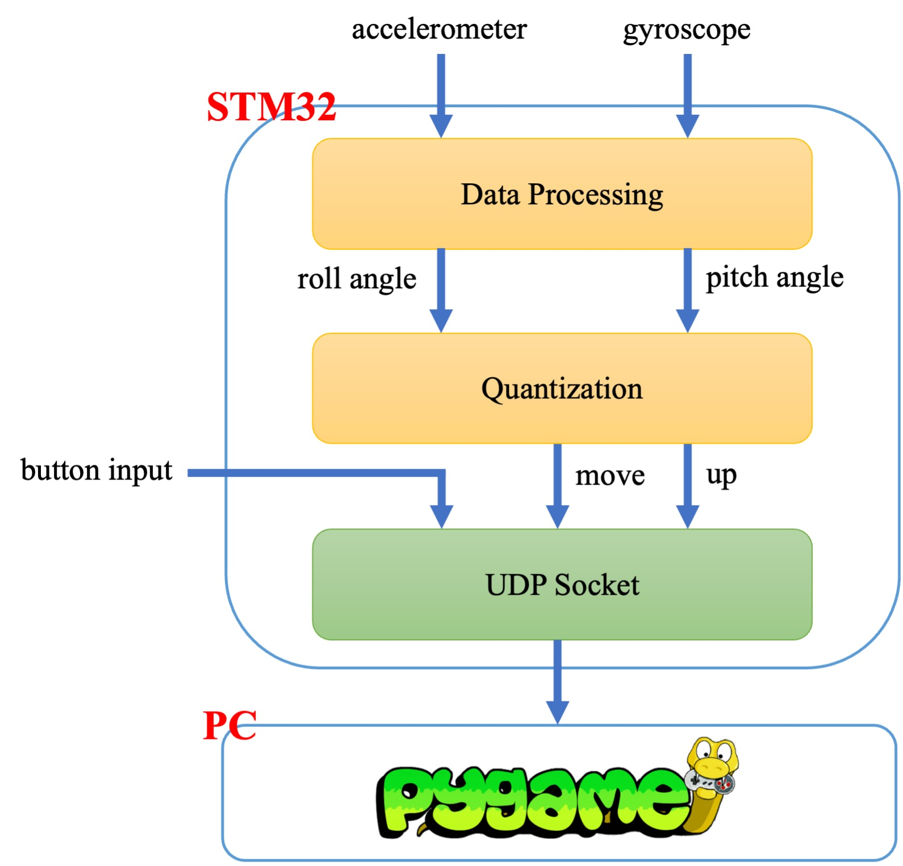
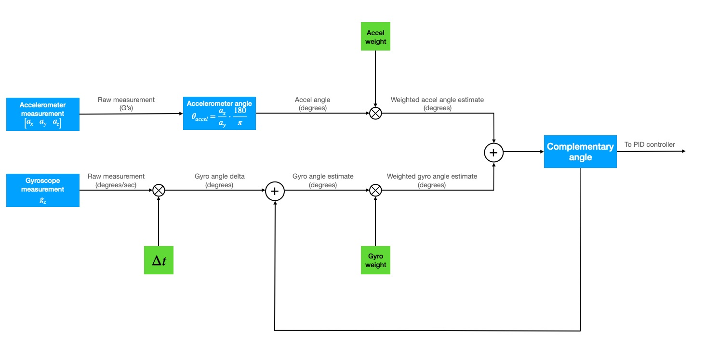
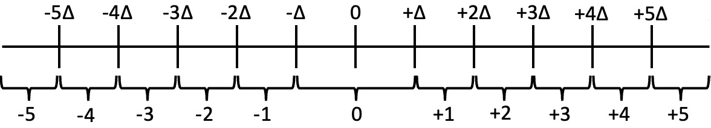
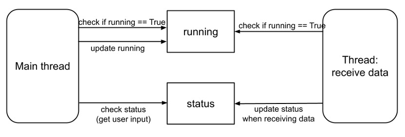

# Doodle Jump Using STM32 Board Sensor

## Members

涂銘洋、毛楷維、古振宏

## Table of contents

- [Framework](#framework)
- [Method](#method)
    - [Data processing: complementary filter](#data-processing-complementary-filter)
    - [Quantization](#quantization)
    - [UDP socket](#udp-socket)
    - [Pygame](#pygame)
- [Demo video](#demo-video)
- [Reference](#reference)

## Framework

## Method

### Data processing: complementary filter

### Quantization

- Pitch angle (forward/backward): threshold = 15°
- Roll angle (left/right): Δ = 4°, range: -10 ~ +10
    

### UDP socket

<!-- TODO -->

### Pygame

- Main thread: game rendering
- Another thread: data receiving

## Demo video

https://www.youtube.com/watch?v=z_7Y-ap9ra4

## Reference

1. Colton S, Mentor FRC. The balance filter. Presentation, Massachusetts Institute of Technology. 2007;
2. Adams VH. Complementary filters: https://vanhunteradams.com/Pico/ReactionWheel/Complementary_Filters.html
3. NTUEE-ESLab/2021-pikachu_volleyball: https://github.com/NTUEE-ESLab/2021-pikachu_volleyball
